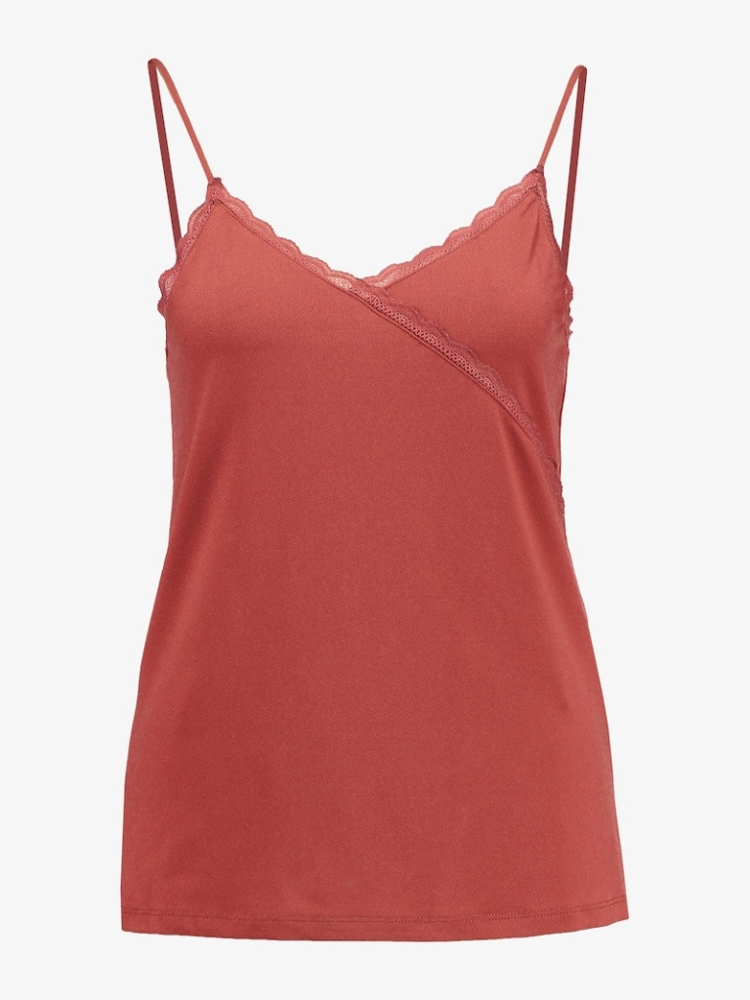
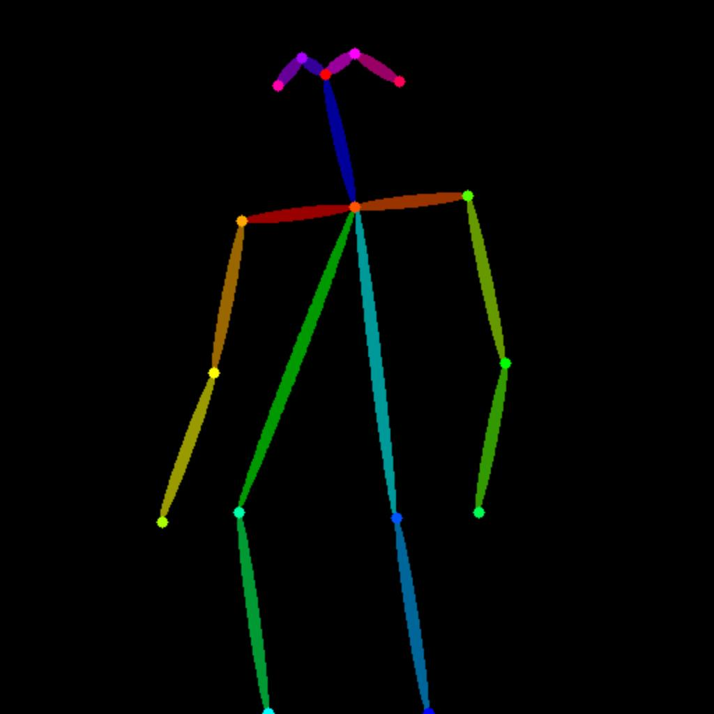
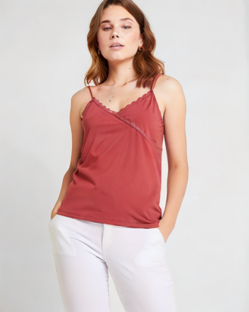
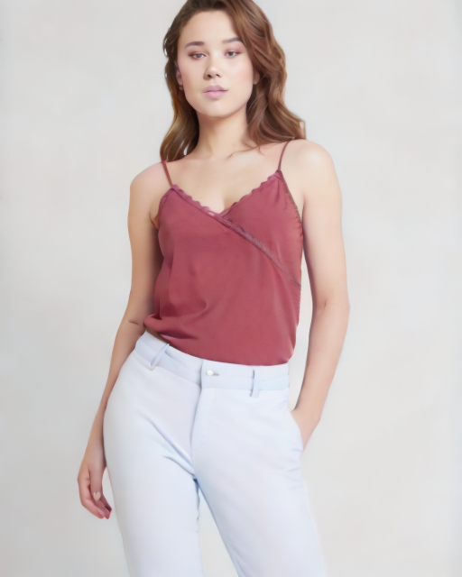
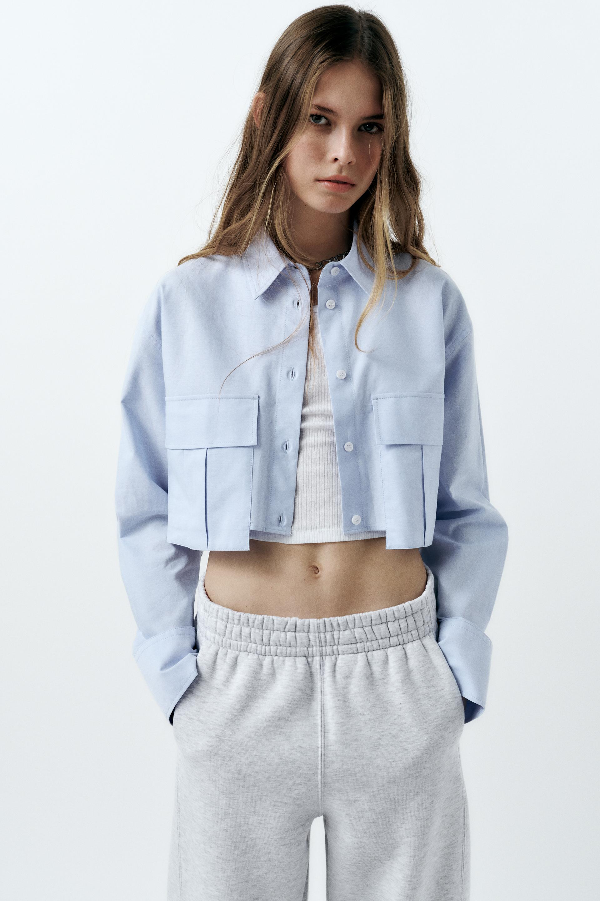
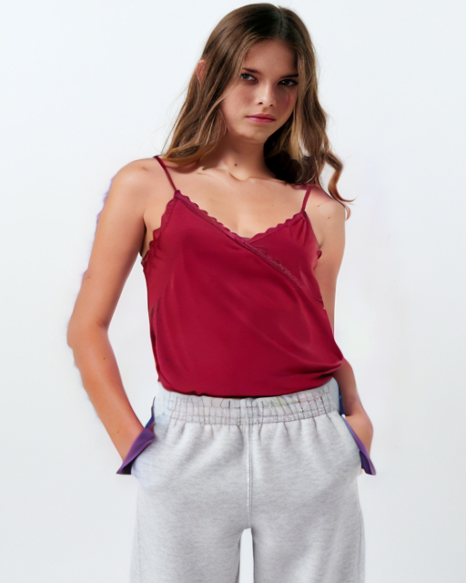

# IMAGDressing-ComfyUI
a custom nodde for [IMAGDressing](https://github.com/muzishen/IMAGDressing), you can find workflow in [workflows](./workflows/)

## Example
test on py3.10，2080ti 11gb，torch==2.3.0+cu121

use case | cloth | pose | face | model_image | output 
----- | ---- | ---- | ---- | ---- | ----
`base` |  | | | | 
`controlnet` |  |  | | | 
`ipa_controlnet` |  |  |  | | 
`inpainting` |  | | |    | 
`cartoon` |  | | |  | 

## How to use
```
# in ComfyUI/custom_nodes
git clone https://github.com/AIFSH/IMAGDressing-ComfyUI.git
cd IMAGDressing-ComfyUI
pip install -r requirements.txt
```
weights will be downloaded from huggingface
## Tutorial
[Demo](https://www.bilibili.com/video/BV1Jb421J754)

## ask for answer as soon as you want
wechat: aifsh_98
need donate if you mand it,
but please feel free to new issue for answering

Windows环境配置太难？可以添加微信：aifsh_98，赞赏获取Windows一键包，当然你也可以提issue等待大佬为你答疑解惑。
